- **概要**: 深層学習コンパイラのサーベイ論文 [The Deep Learning Compiler: A Comprehensive Survey](https://ieeexplore.ieee.org/document/9222299) を基に、深層学習コンパイラの典型的なコンパイラスタックと最適化について説明しています

## はじめに

近年深層学習の目覚ましい進歩が注目を集めています。例えば ChatGPT をはじめとする大規模言語モデルの登場が社会面に大きな影響を与えたことは、記憶に新しいかと思います。

その背後で技術の進展を支えているのが、計算機における計算速度の向上です。深層学習ワークロードは、膨大な計算を必要とします。半導体の微細化がほぼ限界に達し、ムーアの法則の終焉が囁かれる今、ソフトウェアによる計算の高速化が喫緊の課題となっています。

高速化が求められる理由として、深層学習ワークロードにおける計算量の多さが挙げられます。例えば、サイズ $224\ \text{px} × 224\ \text{px}$ の画像を 1000 項目に分類する深さ 50 層の畳み込みニューラルネットワークモデルである ResNet-50 の計算量は、$3.8\times 10^9$ 回$/\text{iter}$ にもなります[^resnet]。これは一般的な CPU で計算させた場合、待ち時間を有意に感じられる程度の時間を要します。

タスクが複雑になり層が深くなるほど計算量は増大し、現実的な時間で終了しなくなることが想像されます。このことは、$10^{11}$ 個ものパラメタをもつ大規模言語モデルの存在から明らかです。他にも自動運転等のリアルタイムで推論結果を必要とするワークロードが存在することを考慮すると、実用化には高速化が欠かせません。

本記事では、このような背景のもと発展したドメイン固有コンパイラ技術、とりわけ深層学習コンパイラの設計について言語化することを試みます。本記事は主に [The Deep Learning Compiler: A Comprehensive Survey](https://ieeexplore.ieee.org/document/9222299)[^survey] に基づいています。

## 深層学習ワークロードの特徴

深層学習コンパイラの目標は、深層学習に特化することで従来の汎用コンパイラより踏み込んだ最適化を行い、処理を高速化することです。そこで、深層学習ワークロードの特徴に注目する必要があります。ワークロードの特徴として、グラフレベル構造と演算子レベル構造の 2 つの構造をもつことが挙げられます。

**グラフレベル構造**とは、高水準なベクトル・テンソル演算によって構成される巨視的な構造のことです。この階層は、深層学習モデルを、高水準な演算をノードとし、データ依存関係をエッジとする計算グラフを用いて、抽象的に表現します。グラフレベル構造では、計算グラフ全体が最適化の対象となります。

また、**演算子レベル構造**とは、低レベルなスカラ・ベクトル命令を用いて表される微視的な構造のことです。この階層は、高水準な演算ノード 1 つ 1 つに着目しており、その構造を低レベル命令を用いて表します。演算ノード自体ある程度の粒度を有するため、演算子レベル構造では演算ノードを最適化の対象とします。

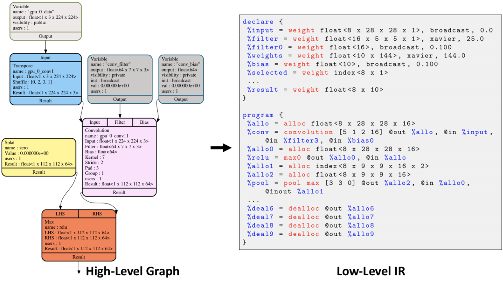
_深層学習ワークロードの特徴的な表現。(左)グラフレベル構造。(右)演算子レベル構造。例として深層学習コンパイラの 1 つである Glow から得られる表現を掲載。[github.com/pytorch/glow](https://github.com/pytorch/glow) より引用。_

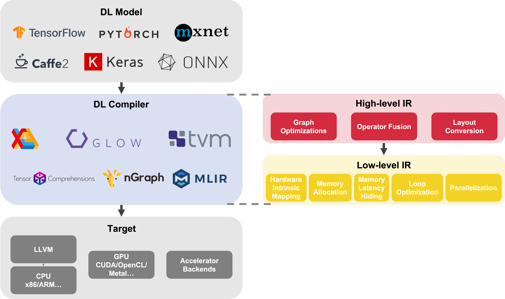
_深層学習コンパイラの典型的なコンパイラスタック。深層学習コンパイラは深層学習モデルを入力とし、CPU/GPU/TPU 等のハードウェア向けのコードを生成する。深層学習コンパイラにおける解析・最適化は主に高レベル中間表現と低レベル中間表現の 2 つの中間表現を経る。[AutoKernel: To know more about AI Compiler](https://autokernel-docs-en.readthedocs.io/en/latest/blog/ai_compiler%20overview.html) 等を参考に作成。_

それぞれの構造の特徴と、それが可能とする最適化の例を箇条書きで示します:

### グラフレベル構造の特徴

- **高水準なベクトル・テンソル演算を単位とした粗視化された計算グラフが与えられる**
  → 高水準な演算を基本単位とする大域的な最適化が実行できる
  例: 粗視化された計算グラフにおける共通部分式削除、不要式削除、代数的簡約化
- **計算のデータ依存関係が明確である。特に、ポインタやエイリアスが存在しない**
  → 積極的にレジスタを再利用できる
  例: 演算子融合

### 演算子レベル構造の特徴

- **単一の命令を複数のデータに対し適用する演算が多い**
  → ハードウェア固有のベクトル命令・テンソル命令を活用できる
  例: ハードウェア固有のマッピング
- **分岐がほとんどない**
  → 分岐予測・投機的実行が重要でない
- **データ依存関係が低レベル命令レベルでも明確である**
  → パイプラインをソフトウェアが決定できる・並列性が比較的容易に抽出できる
  例: パイプラインの静的決定によるメモリレイテンシの隠蔽・並列化
- **メモリアクセスパターンが明確である**
  → メモリキャッシュをソフトウェアが決定できる
  例: メモリ割り当て・データのメモリ階層へのマッピング

---

特筆すべき点として、上述の最適化にはハードウェアとソフトウェアが協調して初めて可能となる最適化が含まれることが挙げられます。そのような最適化としては、**ベクトル命令・テンソル命令をもつハードウェアの活用**と**高度なキャッシュ・パイプラインをもたないハードウェアの活用**の 2 例が考えられます。

### ベクトル命令・テンソル命令をもつハードウェアの活用

深層学習ワークロードの特徴に合わせ、GPU や TPU といったベクトル演算・行列演算に特化したハードウェアが台頭しています。これらのハードウェアを活かすには、ソフトウェアがハードウェア固有命令を使用できる場所を検出し、スカラ命令をベクトル命令・テンソル命令に置換することが必要です。

また、これらのハードウェアは一度に多数のデータを処理できる分、計算速度に比べメモリアクセスが遅くデータ供給が間に合わないという短所をもちます。そのため、計算の特徴を利用してメモリアクセスを極力減らすことも求められます。

**行列行列積**・**畳み込み**といった行列演算は、元々データ再利用性が高いという特徴を持ちます。例えば $n\times n$ 行列の行列積は、データ数 $n^2$ に対し計算量は $O(n^3)$ であり、1 つのデータを最大 $n$ 回再利用することができます。その結果、メモリキャッシュ計画を最適化することで、高速なデータ供給が可能となります。

一方、**ベクトルの加算**・**スカラー倍**といった要素ごとの演算は、データの再利用を行うことはできません。しかし、要素間のデータ依存性がないことから、他の演算と融合して連続して実行することで、メモリアクセスを最初の 1 回のみに削減することができます。

### 高度なキャッシュ・パイプラインをもたないハードウェアの活用

踏み込んだ最適化として、汎用的なプロセッサの進歩とは対照的に、簡素化したハードウェアの活用が挙げられます。CPU 等の従来のプロセッサには、汎用的な計算を高速に実行するために、ハードウェアに高度な機能が備わっています。例として、

- **自動パイプライン**: データ依存関係によってパイプラインが阻害されることを防ぐために、計算結果の変わらない範囲で命令の順序変更を行う仕組み
- **自動メモリキャッシュ**: メモリアクセスの時間的・空間的近接性を利用して、データ使用範囲を予測し事前にキャッシュを行う仕組み
<!-- TODO: 自動パイプライン、自動メモリキャッシュの用語は合ってる? -->

が挙げられます。

しかし深層学習ワークロードは、データ依存関係やメモリアクセスパターンが明確であるという特徴があります。そのため、汎用的な高速化の仕組みに頼らず、ソフトウェアによって静的にパイプライン・メモリキャッシュを制御した方が効率的な計算を実現できます。

その結果、高度なパイプライン・メモリキャッシュをもたないプロセッサ (アクセラレータ等) を有効活用できることが明らかとなりました。これらのハードウェアを活かすために、深層学習コンパイラにはパイプライン・メモリキャッシュの制御といったこれまでハードウェアが担っていた役割が求められます。

---

このように、ソフトウェアだけでなくハードウェアも深層学習ワークロードの特徴に合わせて進化しており、深層学習コンパイラのターゲットは CPU・GPU・TPU・アクセラレータと多岐に渡ります。多様化したターゲットに対応するために、深層学習コンパイラには従来の汎用コンパイラにはないタスクの遂行が求められています。

## 深層学習コンパイラの設計

このように深層学習ワークロードには巨視的な構造と微視的な構造の 2 つの構造があります。これに対応し、深層学習コンパイラでは最適化が可能な 2 つの抽象レベルごとに中間表現が採用されています。これらの中間表現は高レベル中間表現・低レベル中間表現と呼ばれています。

### 高レベル中間表現の特徴

高レベル中間表現は高水準なベクトル・テンソル演算とデータ依存関係を表現します。このレベルで計算グラフはハードウェアに依存しない形式で表されます。

#### 実行される最適化

**巨視的なコンパイラ最適化**: 従来の汎用コンパイラにおいて命令レベルで実行していた最適化の中には、深層学習モデルの演算ノードレベルで適用できる最適化があります。これらの最適化を演算ノードレベルで実行します。そのような最適化には以下の最適化が含まれます。

- **共通部分式削除**: 計算グラフ内で同じ式の計算が複数回現れる場合に、以前の計算結果を再利用します。これにより同じ式の再計算を回避し、計算回数を削減します
- **不要式削除**: 計算グラフ内で計算結果や副作用が使用されていない演算を削除します
- **代数的簡約化**: 代数的性質 (演算子の結合法則、分配法則、交換法則等) を利用して計算コストの削減を行います。演算強度低減、定数畳み込みをはじめとする従来の簡約化に加え、深層学習ワークロード特有のテンソルに関する簡約化が行われます
  :::details テンソル簡約化の一例
  - テンソル演算の性質を利用した演算回数削減: 例えば転置した行列の積を行列積の転置に置き換えます
    $$A^\top B^\top=(BA)^\top$$
  - テンソルの形状変換の最適化: 例えば連続する転置を削除したり、連続する Reshape を 1 つの Reshape にまとめます
    $$(A^\top)^\top=A,\quad\mathrm{Reshape}(\mathrm{Reshape}(A))=\mathrm{Reshape}(A)$$
  - テンソルの形状変換の順序変更: 例えば Pooling によってテンソルの要素数が減少する場合に、他の演算の前に Pooling を先に実行します
    $$\mathrm{MaxPool}(A^\top)=(\mathrm{MaxPool}(A))^\top$$
    :::
    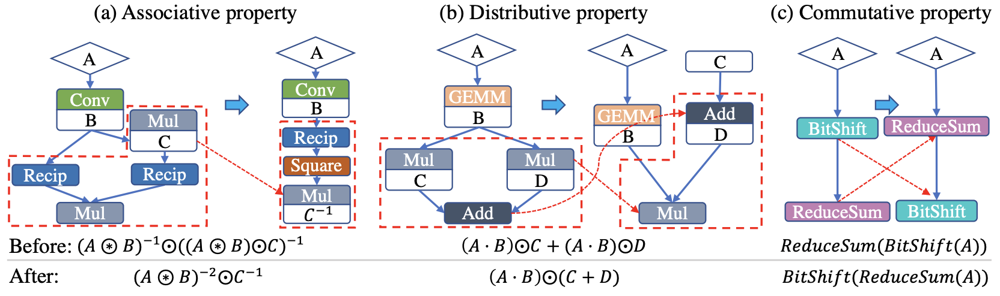
    _代数法則を活用した最適化の例[^dnnfusion]。(a)では結合法則、(b)では分配法則を利用し計算回数を削減する。(c)では ReduceSum により要素数が減ることを考慮し、演算子の交換法則を利用して計算回数を削減する。_

**演算子融合:** 演算子融合は深層学習コンパイラにおける主要な最適化手法の 1 つです。複数の演算子を 1 つにまとめることで、計算時間やメモリ消費量を削減し、実行効率を向上させます。例えば畳み込みニューラルネットワークでは畳み込み演算と活性化関数の演算が頻繁に行われますが、これらの演算子を融合することで、より効率的な計算が可能となります。演算子融合によって、中間結果のメモリアクセスが削減され、メモリ帯域幅のボトルネックが緩和されるため、高速な計算が可能となります。

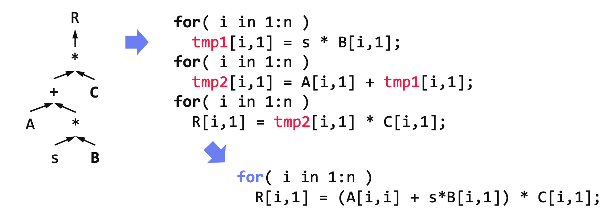
_演算子融合の概念図。(左) $R=(A+sB)*C$ を表す計算グラフ。(右上)計算グラフをそのまま低レベル命令に書き下した場合の疑似コード。演算ノードを 1 つずつ実行する場合、計算結果を逐一メモリに書き込むため、メモリレイテンシが発生する。(右下)演算子融合後の計算グラフを低レベル命令に書き下した場合の疑似コード。一時メモリへの書き込み・読み出しがなくなるため高速な計算が可能となる。[Architecture of ML Systems - 05 Compilation and Optimization](https://mboehm7.github.io/teaching/fs22_amls/index.htm) より引用。_

演算子の融合戦略は複数考えられますが、ここでは例として、TVM という深層学習コンパイラにおける演算子の融合戦略について説明します[^tvm]。TVM では演算子融合に際し、演算子を

- injective: 同一の添字間でのみ演算を行う写像。Add, Sqrt, BatchNorm, ReLU など
- reduction: ベクトルの要素間に演算を繰り返し適用することで次元を減らし、1 つのスカラにする写像。Sum, Max など
- complex-out-fusable: 1 つの添字が複数の演算で使用される写像。MatMul, Conv など
- opaque: 添字間の依存関係が複雑な写像。Transpose, Sort など

の 4 種類に分類しています。このとき、融合可能な演算子の組み合わせは以下のようになります。

- 連続する複数の injective を 1 つの injective に融合できる
- 入力が injective、出力が reduction である 2 つの演算ノードを 1 つに融合できる
- 入力が complex-out-fusable、出力が injective である 2 つの演算ノードを 1 つに融合できる
- opaque は他の演算子と融合できない

例えば以下の図のように入力の Conv と出力の BatchNorm, ReLU を 1 つの演算ノードに融合することができます。

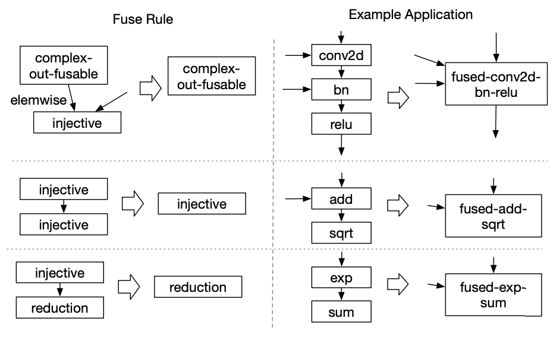
_TVM における演算子の融合戦略と融合例[^tvm-end]。(上段)入力の Conv と出力の BatchNorm, ReLU を融合できる。(中段)Add と Sqrt を融合できる。(下段)入力の Exp と出力の Sum を融合できる。_

**データレイアウト変換**: 計算グラフにおいてテンソルを保持する最適なデータレイアウトを探索し、レイアウト変換ノードをグラフに挿入します。ここで最適なレイアウトはハードウェア依存しています。例えば GPU 上では NCHW 形式のデータレイアウトにおいて高速に動作します (ここで NCHW とはバッチ内の画像数$N$、高さ方向の画素数$H$、幅方向の画素数$W$、チャンネル数$C$(グレースケールの場合$C=1$、RGB の場合$C=3$)を格納する順番を指します)。他にもアクセラレータの中には、ハードウェア固有命令やキャッシュの都合上より複雑なデータレイアウトを好むものも存在します。

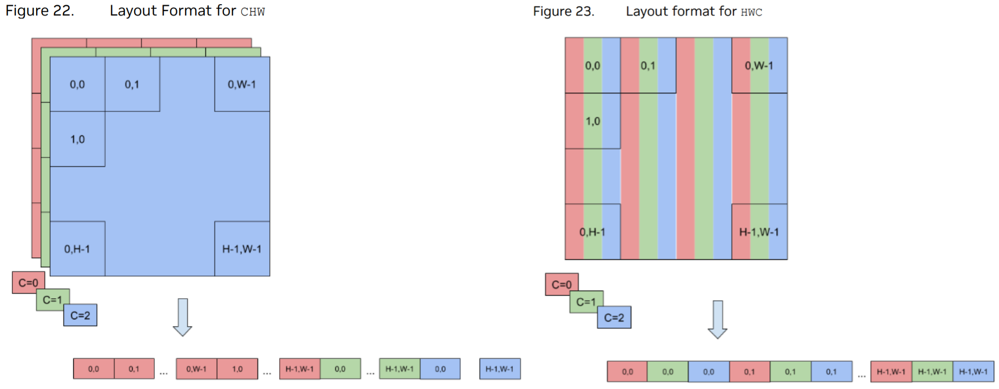
_各フォーマットにおける GPU メモリへの格納のされ方。(左)CHW フォーマットの場合。色が同じデータが隣接して格納されている。(右)HWC フォーマットの場合。座標が同じデータが隣接して格納されている。畳み込み等の演算において異なるチャンネル間の混成は生じないため、一般に CHW フォーマットの方が高速に演算を実行できる。[NVIDIA TensorRT Developer Guide](https://docs.nvidia.com/deeplearning/tensorrt/developer-guide/index.html) より引用。_

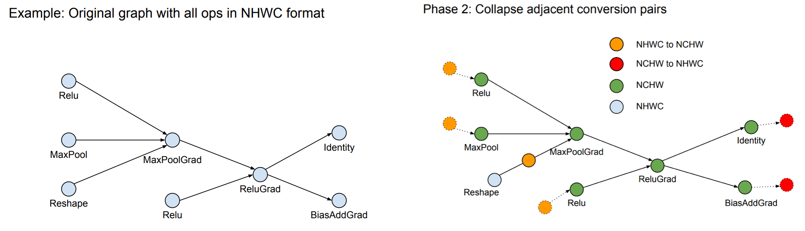
_レイアウト変換の例。Reshape 以外の演算は NHWC フォーマットから NCHW フォーマットに変換されている。NHWC フォーマットから NCHW フォーマット(あるいは逆)への変換が必要な箇所にレイアウト変換ノードが挿入されている。[TensorFlow Graph Optimization](https://web.stanford.edu/class/cs245/slides/TFGraphOptimizationsStanford.pdf) より引用。_

<!-- #### その他の役割: 意味解析 - 形状推 - 暗黙のブロードキャストの明示化 -->

### 低レベル中間表現の特徴

低レベル中間表現はワークロードを低レベル命令を用いて表現します。このレベルではハードウェア依存の最適化も実行されるため、ハードウェア固有の操作を表現できるほど詳細な命令を表現できる必要があります。

### 実行される最適化

**ハードウェア固有のマッピング**: 低レベル中間表現で記述された特定の命令パターンを、ハードウェア上で高度に最適化されたカーネルに置き換えます。

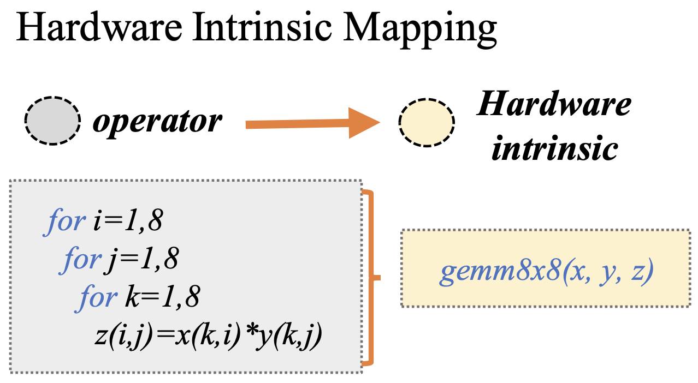
_ハードウェア固有のマッピングの模式図[^survey]。$8\times 8$行列の行列積をハードウェア固有のカーネルに置き換える。_

**メモリ階層へのアクセスの調整**: 計算機のメモリは、容量は大きいが遅延が大きいメモリと、容量は小さいが遅延が小さいキャッシュを用いた階層構造を持ちます。このメモリ階層はプロセッサごとに異なるため、ハードウェア専用の最適化が必要です。CPU ではプリフェッチや効率的にデータを追い出すハードウェア機能によって効率的なメモリアクセスが暗黙的に実現されます。一方 GPU は共有メモリとローカルメモリを有し、メモリ割り当てをコンパイラとハードウェアが担う箇所が混在しています。また高度なキャッシュを持たないアクセラレータでは、コンパイラがデータ再利用性の高いメモリキャッシュを決定します。

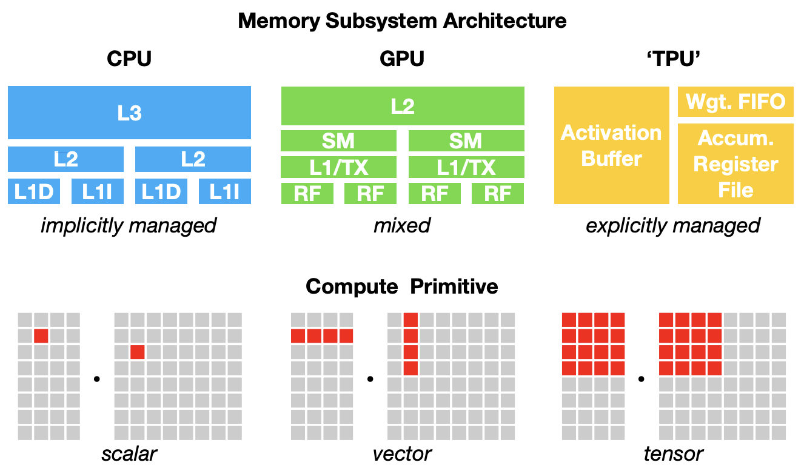
_CPU・GPU・TPU のメモリアーキテクチャと演算の基本単位[^tvm]。このようなハードウェアの多様性を考慮したコードを生成することがコンパイラには求められる。_

**メモリレイテンシの隠蔽**: パイプラインを再構成し、メモリアクセスと計算の実行を可能な限り並列化することでメモリアクセスに由来する遅延を隠蔽します。CPU ではハードウェアプリフェッチ、GPU ではワープコンテキストスイッチといったハードウェアの機能によってメモリレイテンシの隠蔽は暗黙的に実現されます。一方高度なパイプラインを持たないアクセラレータの場合は、コンパイラがデータ依存関係を解析し、命令の同期やスケジューリングを実行する必要があります。

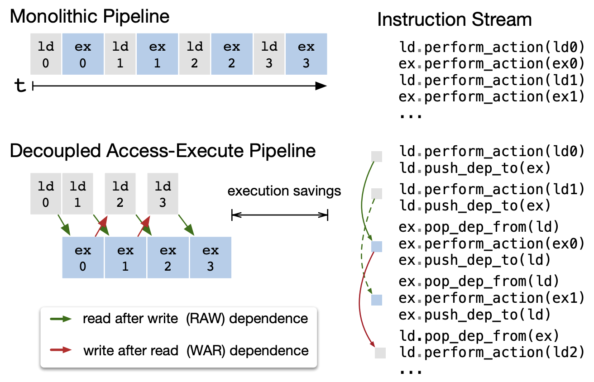
_メモリアクセスレイテンシ隠蔽の模式図[^tvm]。ハードウェアにおいてメモリアクセスと実行を分離し、メモリと計算をオーバーラップさせることで、多くのメモリアクセスレイテンシを隠蔽することができる。_

**ループ最適化**: ループはプログラムの大部分を占めるため、ループ最適化はプログラムの実行効率を向上させるために非常に重要な手法です。ループ最適化には、ループ融合、sliding window、タイル化、ループ交換およびループ展開などがあります。

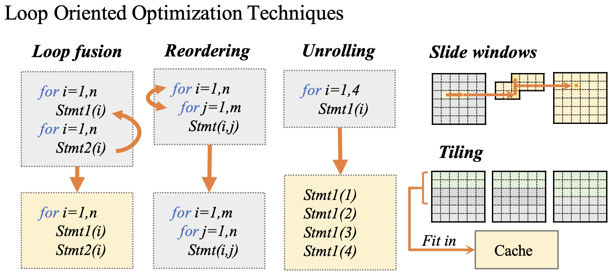
_各ループ最適化 (ループ融合、ループ交換、ループ展開、sliding window およびタイル化) の模式図[^survey]。_

:::details ループ最適化の詳細

- ループ融合: 同じ境界を持つループを融合することで、データ再利用性を向上させる
- Sliding window: Halide で考案された最適化。中心的なコンセプトは、必要なときに値を計算し、必要なくなるまでデータを再利用するというもの
- タイル化: ループをいくつかのタイルに分割することで、タイルをハードウェアキャッシュに適合させ、タイル内のデータ局所性を向上させる

  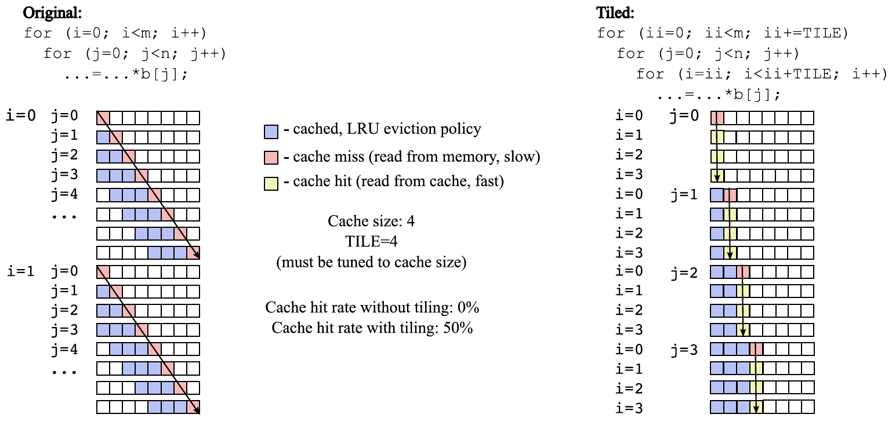
  _タイル化を行わない場合と行う場合のキャッシュミスの頻度の比較。(左)タイル化を行わない場合。常にキャッシュミスが生じている。(右)タイルサイズ 4 のタイル化を行った場合。キャッシュミスの頻度は 25%にまで減少する。[HOW Series “Deep Dive”: Webinars on Performance Optimization - 2017 Edition - Session 10](https://colfaxresearch.com/how-series/#ses-10) より引用。_

- ループ交換: ネストされたループの反復順序を変更することで、メモリアクセスを最適化し、空間局所性を向上させる
- ループ展開: タイル化されたループの内側のループを展開することで、コンパイラがアグレッシブに命令レベル並列化を適用できるようにする

:::

**並列化**: プロセッサは一般にマルチスレッドと SIMD 並列をサポートするため、コンパイラは並列性を利用してハードウェアを最大限に活用することが求められます。低レベル中間言語は並列化を意識して設計されており、その設計は主に以下の 2 種類に分類されます。

**Halide ベースの中間表現**: Halide とは、画像処理のために設計されたドメイン固有言語であり、並列化やベクトル化を用いて高度に最適化された画像処理プログラムを生成することを目的としています。Halide で生まれた最適化技術の 1 つに、「アルゴリズムとスケジューリングの分離」が挙げられます。Halide は指定されたスケジュールに従う様々なコードを生成することで、最適なスケジュールの探索を実現しています[^halide]。例えば 3x3 ボックスフィルタのアルゴリズムとスケジュールは以下のように記述することができます。

```cpp
Func blur_3x3(Func input) {
  Func blur_x, blur_y;
  Var x, y, xi, yi;

  // The algorithm - no storage or order
  blur_x(x, y) = (input(x-1, y) + input(x, y) + input(x+1, y))/3;
  blur_y(x, y) = (blur_x(x, y-1) + blur_x(x, y) + blur_x(x, y+1))/3;

  // The schedule - defines order, locality; implies storage
  blur_y.tile(x, y, xi, yi, 256, 32)
        .vectorize(xi, 8).parallel(y);
  blur_x.compute_at(blur_y, x).vectorize(x, 8);

  return blur_y;
}
```

_$3\times 3$ ボックスフィルタのアルゴリズムとスケジュール定義。[halide-lang.org](https://halide-lang.org/) より引用。_

Halide で生まれたこの概念は深層学習コンパイラに応用できることが示されており、TVM 等の一部の深層学習コンパイラは低レベル中間表現として Halide ベースの中間表現を用いています。

Halide ベースの中間表現の特徴として、手動スケジューリングと自動パラメタチューニングが挙げられます。スケジュールはプログラマの手で明示的に指定され、アルゴリズムとスケジューリングの分離に基づき簡潔に記述することができます。一方、ループタイリングのタイルサイズに代表される最適化パラメタは、コストモデルに基づき自動的に調整されます[^tvm]。例えば TVM を用いてベクトルの加算を並列するコードは、以下のように記述することができます。

```python
import tvm as t

n = t.var('n')
A = t.placeholder((n,), name='A')
B = t.placeholder((n,), name='B')

# define algorithm
C = t.compute(A.shape, lambda i: A[i] + B[i], name='C')

# add thread-level parallelism
s = t.create_schedule(C.op)
s[C].parallel(C.op.axis[0])
```

_TVM を用いてベクトルの加算を並列化する例。_

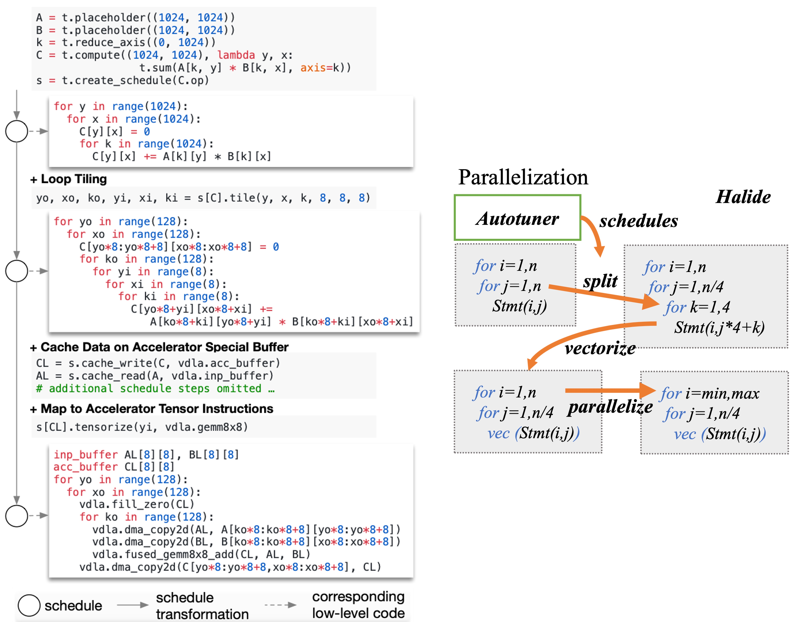
_(左)TVM を用いて演算子を記述する流れと、各段階において生成される中間表現の疑似コード[^tvm]。(1 つ目の疑似コード)スケジューリングを行わない場合。(2 つ目)ループをサイズ$128\times 8$にタイル化した場合。(3 つ目)さらにバッファへのキャッシュを行いハードウェア固有命令を用いた場合。(右)Halide ベースの中間表現における並列化の概念図[^survey]。与えられたスケジュールに基づき並列化を実行する。最適化パラメタは自動でチューニングされる。_

**多面体コンパイルに基づく中間表現**: 多面体コンパイルとは、多面体モデルに基づくループ最適化手法の 1 つです。ネストしたループのループ境界がループカウンタのアフィン変換で書けるとき、ループが構成するループカウンタの組み合わせ (反復空間) は多面体の格子点として表されます。またデータ依存関係にある配列要素のインデックスがループカウンタのアフィン変換で書ける場合、要素間のデータ依存関係は反復空間を区切るメッシュのように表すことができます。多面体モデルはこのような直線的な構造を利用したループ最適化を可能とします。多面体モデルを用いることで、ループ融合、タイル化、ループ交換およびループ展開といった種々のループ最適化を統一的に表現できるという利点があります。

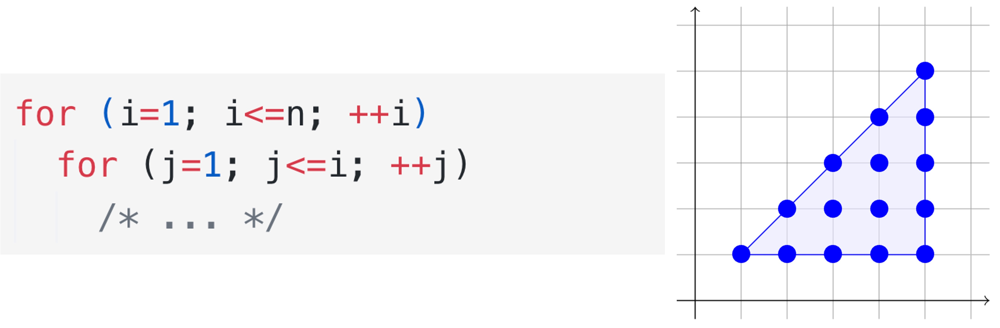
_(左)ループ境界がループカウンタ$i$のアフィン変換で書ける例。(右)左の例におけるループの反復空間。反復空間は連立不等式 $i≤n, j=1, j≤i$ によって構成される三角形をなす。_

TensorComprehension などの一部の深層学習コンパイラの低レベル中間表現では、多面体コンパイルに基づく中間表現が採用されています。この中間表現の特徴として、自動で並列性を抽出しスケジューリングを実行できることが挙げられます。

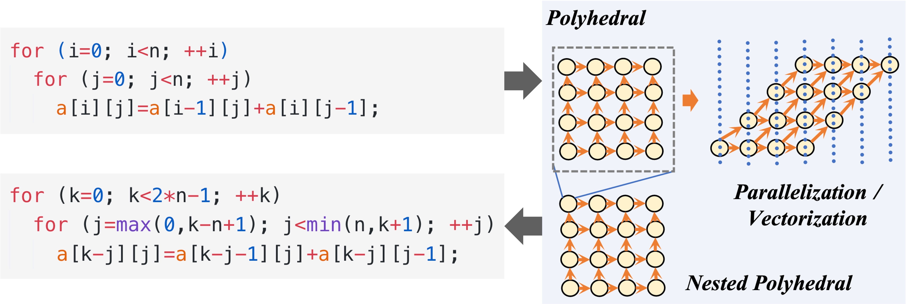
_多面体コンパイルの実行例。(左上)変換前のループ。データ依存関係にある配列要素のインデックスがループカウンタ$i, j$のアフィン変換($i-1, j-1$)で表されている。(右)このループのループネストをタイル化し、並列化した場合のデータ依存関係の模式図[^survey]。インデックスを取り替えることで並列化可能な要素を抽出することができる。(左下)最適化後のループ。$i=k-j$ と変換した結果、内側のループが辿る要素間のデータ依存関係が消失し、内側のループを並列化することができる。_

## 深層学習コンパイラの具体例

主要な深層学習コンパイラと、そこで用いられている高レベル中間表現・低レベル中間表現について紹介します。

<!-- prettier-ignore -->
| Icon | Compiler | Developer | High-level IR | Low-level IR |
| --- | --- | --- | --- | --- |
|  | XLA | Google | TensorFlow Graph・HLO | linalg dialect, vector dialect in MLIR |
|  | TVM | Apache | Relay IR | Halide IR |
|  | TensorComprehensions (archived) | Facebook | TC IR (Halide-based) | Polyhedral IR |
|  | Glow | Facebook | Own high-level IR | Own low-level IR |

- **XLA**: Google にて開発されている深層学習コンパイラであり、TensorFlow の一部です。TensorFlow では、TensorFlow Graph にてハードウェア非依存の最適化を行った後、HLO に変換されます。HLO は、ハードウェア固有の情報を表現できるほど細かい粒度を有し、高レベル中間表現と低レベル中間表現の両方の側面を持っています。また、TensorFlow は MLIR と呼ばれる中間表現基盤に接続可能なパスを備えており、MLIR において開発されている中間表現(linalg dialect や vector dialect)を利用した最適化を実行することができます。※ OpenXLA について考慮することはできていません
- **TVM**: Apache が管理している深層学習コンパイラ。Relay IR は TVM にて用いられている高レベル中間表現であり、ラムダ式を用いた計算の表現により演算子のカスタマイズをサポートしている、固定された演算子の組み合わせに留まらない演算子融合が可能である、といった特徴を持ちます。また TVM は低レベル中間表現に Halide IR を使用しており、アルゴリズムから分離されたスケジュールプリミティブの定義や自動パラメタチューニングを可能としています
- **TensorComprehensions**: Facebook にて開発されている深層学習コンパイラ (現在は開発停止)。Halide ベースの高レベル中間表現と多面体モデルを利用した低レベル中間表現を特徴としています

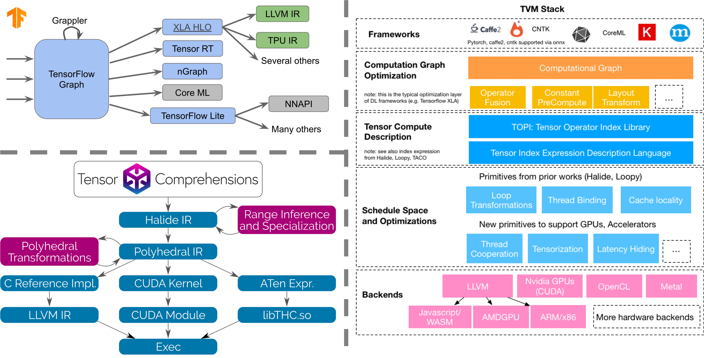
_各深層学習コンパイラのコンパイラスタック。(左上)TensorFlow (右)TVM (左下)TensorComprehensions [CGO 2020 Talk](https://docs.google.com/presentation/d/11-VjSNNNJoRhPlLxFgvtb909it1WNdxTnQFipryfAPU/edit#slide=id.g7d334b12e5_0_211), [TVM Developer Documentation Feedback](https://github.com/apache/tvm/issues/2469#issuecomment-455940771), [Announcing Tensor Comprehensions](https://research.facebook.com/blog/2018/2/announcing-tensor-comprehensions/) より引用。_

## おわりに

本記事では、深層学習コンパイラの全体像、特にコンパイラスタックと独自の最適化技術に焦点を当てて説明しました。深層学習コンパイラは、高レベル中間表現と低レベル中間表現を用いた多段階処理に基づいて設計されており、それぞれハードウェアに依存しない最適化とハードウェア固有の最適化を行います。最適化技術には、演算子融合、メモリアクセス最適化、ループ最適化、ハードウェア固有マッピングなどが含まれており、これらによって高速で効率的な深層学習モデルのコンパイルが実現されています。

本記事で扱えなかったこととして、以下のことが挙げられます。

- **具体的な深層学習コンパイラの設計**: 本記事では XLA・TVM・Glow などの最適化フレームワークを紹介しましたが、個々のコンパイラの設計の詳細については触れられませんでした。これらのコンパイラはそれぞれ異なる設計思想や特徴を持っており、中間表現スタックや最適化の詳細はまた異なった視点を与えてくれます
- **MLIR**: MLIR とは、中間表現の設計と実装の簡素化を目的に開発された、ドメイン固有コンパイラを構築するための中間表現基盤です。TensorFlow において開発され、LLVM に寄贈されたという経緯を持ちます。MLIR は主に TensorFlow の内部で使用されており、柔軟で拡張可能な中間表現によって中間表現の開発を改善しています。MLIR はドメイン固有コンパイラの開発において大きな役割を担いつつありますが、その設計思想や有用性については、本記事では触れられませんでした

本記事は正確を期していますが、筆者の不勉強のために誤りが含まれる可能性があります。お気づきの点がございましたら、コメント頂けますと幸いです。

[^survey]: [The Deep Learning Compiler: A Comprehensive Survey](https://ieeexplore.ieee.org/document/9222299)
[^resnet]: [Deep Residual Learning for Image Recognition](https://arxiv.org/abs/1512.03385)
[^tvm]: [TVM: An Automated End-to-End Optimizing Compiler for Deep Learning](https://arxiv.org/abs/1802.04799)
[^tvm-end]: [TVM: End-to-End Optimization Stack for Deep Learning](https://dada.cs.washington.edu/research/tr/2017/12/UW-CSE-17-12-01.pdf)
[^halide]: [Decoupling algorithms from schedules for easy optimization of image processing pipelines](https://dl.acm.org/doi/pdf/10.1145/2185520.2185528)
[^dnnfusion]: [DNNFusion: accelerating deep neural networks execution with advanced operator fusion](https://dl.acm.org/doi/10.1145/3453483.3454083)
[^relaxed-graph]: [Optimizing DNN Computation with Relaxed Graph Substitutions](https://cs.stanford.edu/~matei/papers/2019/sysml_relaxed_graph_substitutions.pdf)
[^xla]: [Operator Fusion in XLA: Analysis and Evaluation](https://arxiv.org/abs/2301.13062)

<!-- 脚注の書き方^[[How to write footnotes](https://zenn.dev/zenn/articles/markdown-guide#%E6%B3%A8%E9%87%88)]。 -->
